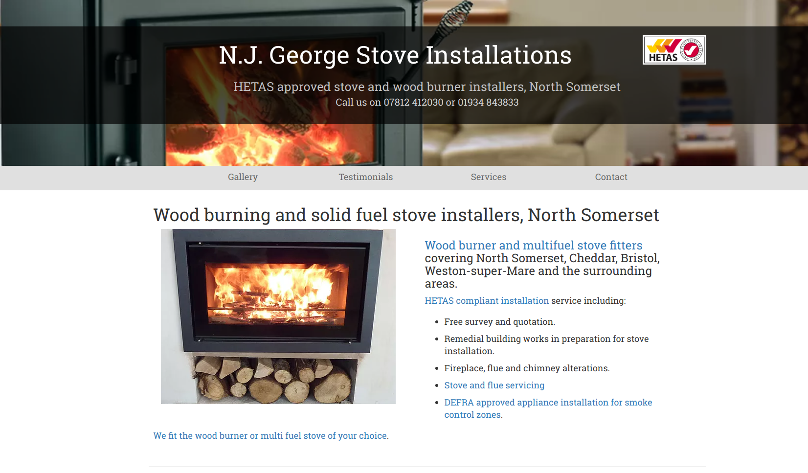

# [N.J. George Stove Installations](https://njgeorgestoveinstallations.co.uk/)

HETAS approved stove installation business website built with Hugo, the Go-Lang static site generator



## Dependencies

- [Go-Lang](https://golang.org/) 
- [Hugo](https://gohugo.io/getting-started/quick-start/)

## Development

Run in development mode

```bash
hugo server -D
```

## Generate site

```bash
hugo
```

## Deploy using Firebase

Follow Firebase hosting setup documented here: https://firebase.google.com/docs/hosting/

```
hugo && firebase deploy
```
